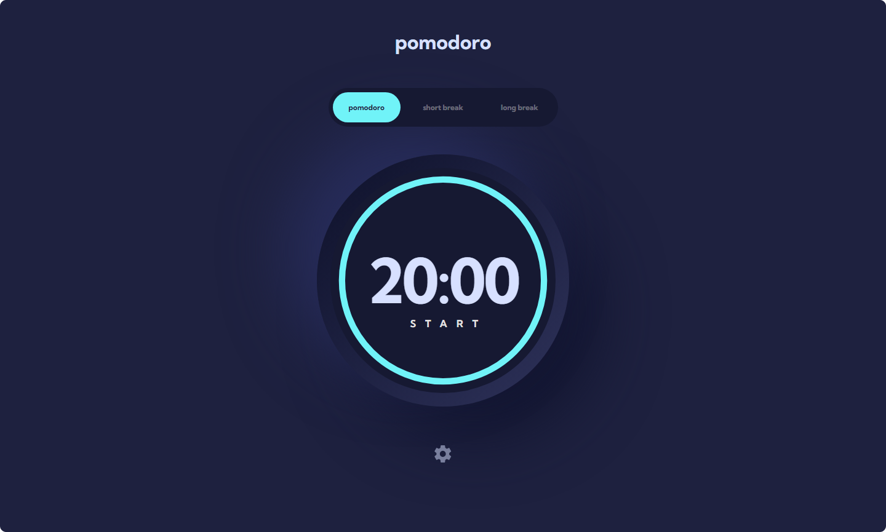
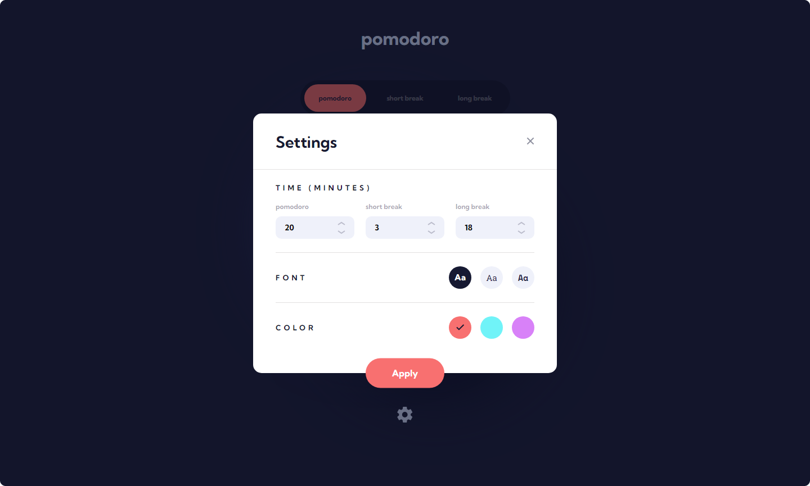

# Frontend Mentor - Pomodoro app solution

This is a solution to the [Pomodoro app challenge on Frontend Mentor](https://www.frontendmentor.io/challenges/pomodoro-app-KBFnycJ6G). Frontend Mentor challenges help you improve your coding skills by building realistic projects. 

## Table of contents

- [Overview](#overview)
  - [The challenge](#the-challenge)
  - [Screenshot](#screenshot)
  - [Links](#links)
- [My process](#my-process)
  - [Built with](#built-with)
  - [What I learned](#what-i-learned)
  - [Continued development](#continued-development)
- [Author](#author)

## Overview

### The challenge

Users should be able to:

- Set a pomodoro timer and short & long break timers
- Customize how long each timer runs for
- See a circular progress bar that updates every minute and represents how far through their timer they are
- Customize the appearance of the app with the ability to set preferences for colors and fonts

### Screenshot





### Links

- Solution URL: [GitHub Repo](https://github.com/ryanbradley-webdev/pomodoro)
- Live Site URL: [Hosted on Netlify](https://pomodoro-app-rbwd.netlify.app/)

## My process

### Built with

- [React](https://reactjs.org/) - JS library
- [TypeScript](https://www.typescriptlang.org/) - Type Safety
- [Vite](https://vitejs.dev/) - Web Bundling and Scaffolding

### What I learned

I used this project to expand my knowledge and use of TypeScript, specifically in building types in a modular and scalable way using expected data options.

This project uses a simple but layered data object to represent a user's preferences, and my objective was to define the types of this app using a set of default preferences and concrete options. The allowed options for Font, Color Theme, and Timer are as below:

```js
export const FONT_OPTIONS = [ 'Kumbh Sans', 'Roboto Slab', 'Space Mono' ] as const
export const COLOR_OPTIONS = [ 'orange', 'teal', 'purple' ] as const
export const TIMER_OPTIONS = [ 'pomodoro', 'short break', 'long break' ] as const
```

Using these available options I scaffolded basic types for a single option of each of these arrays:

```js
export type FontOption = typeof FONT_OPTIONS[number]
export type ColorOption = typeof COLOR_OPTIONS[number]
export type TimerOption = typeof TIMER_OPTIONS[number]
```

This allowed me to define methods and components using these types in order to expect one of the available options instead of using a generic 'string' type. These types make up most of the global user preferences object type, with the addition of one other type. This type would be to hold an object whose keys would be the available timer options and values would be the times the user would save for each option. In order to define this type, I defined it in TypeScript as below:

```js
export type TimerTimes = {
  [K in typeof TIMER_OPTIONS[number]]: number
}
```

This allows me to add, remove, or change a timer option in the TIMER_OPTIONS array without redefining my type.

Finally, I could construct my preferences object type as a combination of these previous types:

```js
export type AppSettings = {
  font: FontOption
  color: ColorOption
  timer: TimerOption
  timerTimes: TimerTimes
}
```

Using this method I was able to define methods and components which draw from this global type, in part or in whole, without having to define standalone types or try to force functions to accept partial types.

### Continued development

I will be integrating the lessons learned in building this app into other projects across the board, specifically in designing my own Vite/React/TS scaffold for starting projects. I also intend to further refine the animation in this project, specifically with the settings modal.

## Author


- Visit my portfolio - [ryanbradleyportfolio.com](https://ryanbradleyportfolio.com)
- Contact me for your next website - [ryanbradleywebdev.com](https://ryanbradleywebdev.com)
- Email me - [ryan@ryanbradleywebdev.com](ryan@ryanbradleywebdev.com)
- Follow my Instagram - [@ryanbradley_web_dev](https://www.instagram.com/ryanbradley_web_dev/)
